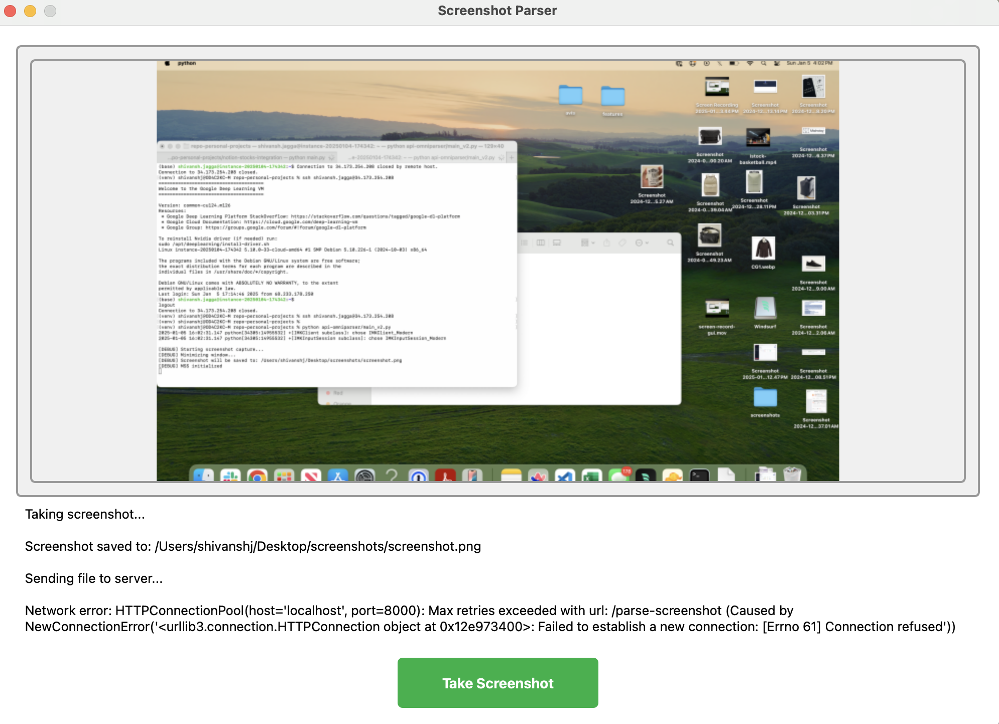

main_v2.py has thread-safe execution of UI so we will be running that file.

This is a project to use microsoft's Omiparser to detect the elements on a desktop screen. 

# Step 1 - Create virtual env

1. `python -m venv ./venv`
2. `source venv/bin/activate`
3. `pip install -r requirements.txt`

# Step 2 - Get omniparser

1. Clone in the same folder from this repo : https://github.com/microsoft/OmniParser
2. `pip install -r Omniparser/requirements.txt`


### Download its weights:

1. `cd` into the Omniparser directory
2. Run `huggingface-cli download microsoft/OmniParser --local-dir weights/` to download latest weights

Test Omniparser is working:
(The following code is taken from their README.md)
```
python gradio_demo.py --icon_detect_model weights/icon_detect_v1_5/model_v1_5.pt --icon_caption_model florence2
```
Some basic error might show up here as we are dealing with a 3rd party library.
1. Package errors that need to be upgraded (like ultralytics)
2. Module errors in code


Note: Because this is an external repo, some weights may be updated if you're cloning this


# Step 3 - Run the server:


1. `cd` back into parent dir
2.  Run `uvicorn core_server.server:app`
3. Confirm `localhost:8000/docs`


# [Optional] Step 4 - GUI:

1. Run `python main_v2.py`




